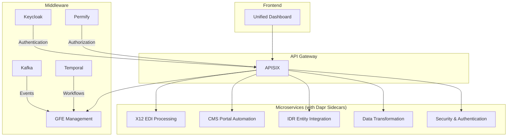

# NSA/IDR Healthcare Platform - Middleware Architecture

## 1. Introduction

This document outlines the design and implementation of a comprehensive middleware stack for the NSA/IDR Healthcare Platform. The goal is to create a production-grade, cloud-native architecture with enterprise-level capabilities for microservices communication, identity and access management, authorization, workflow orchestration, event streaming, and API management.

## 2. Middleware Stack Components

| Component | Category | Description |
|---|---|---|
| **Dapr** | Microservices Runtime | Provides APIs for service-to-service invocation, state management, pub/sub, and more. |
| **Keycloak** | Identity & Access Management | Manages user authentication and identity brokering. |
| **Permify** | Authorization | Fine-grained authorization as a service. |
| **Temporal** | Workflow Orchestration | Replaces the existing BPMN workflow engine with a code-first, durable workflow system. |
| **Kafka** | Event Streaming | Decouples services and enables event-driven architecture. |
| **APISIX** | API Gateway | Replaces the existing API gateway with a more powerful and flexible solution. |

## 3. Architecture Overview

## 4. Dapr Configuration

Dapr will be used to provide a consistent set of APIs for all microservices. This will simplify development and improve portability.

### 4.1. Components

- **State Store:** Redis will be used for state management.
- **Pub/Sub:** Kafka will be used as the message broker.
- **Service Invocation:** Dapr will handle service-to-service communication.

### 4.2. Configuration Files

- `dapr/config.yaml`: Global Dapr configuration.
- `dapr/components/statestore.yaml`: Redis state store component.
- `dapr/components/pubsub.yaml`: Kafka pub/sub component.

## 5. Implementation Plan

1.  **Phase 1: Dapr Integration:** Integrate Dapr with all existing microservices.
2.  **Phase 2: Identity & Authorization:** Implement Keycloak and Permify.
3.  **Phase 3: Workflow Orchestration:** Replace the BPMN workflow engine with Temporal.
4.  **Phase 4: Event Streaming:** Implement Kafka for event-driven communication.
5.  **Phase 5: API Gateway:** Replace the existing API gateway with APISIX.
6.  **Phase 6: Integration & Testing:** Integrate all middleware components and perform end-to-end testing.

